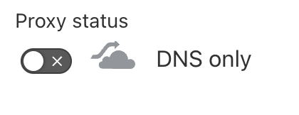
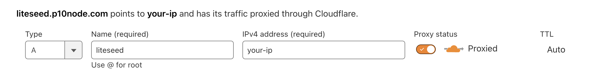
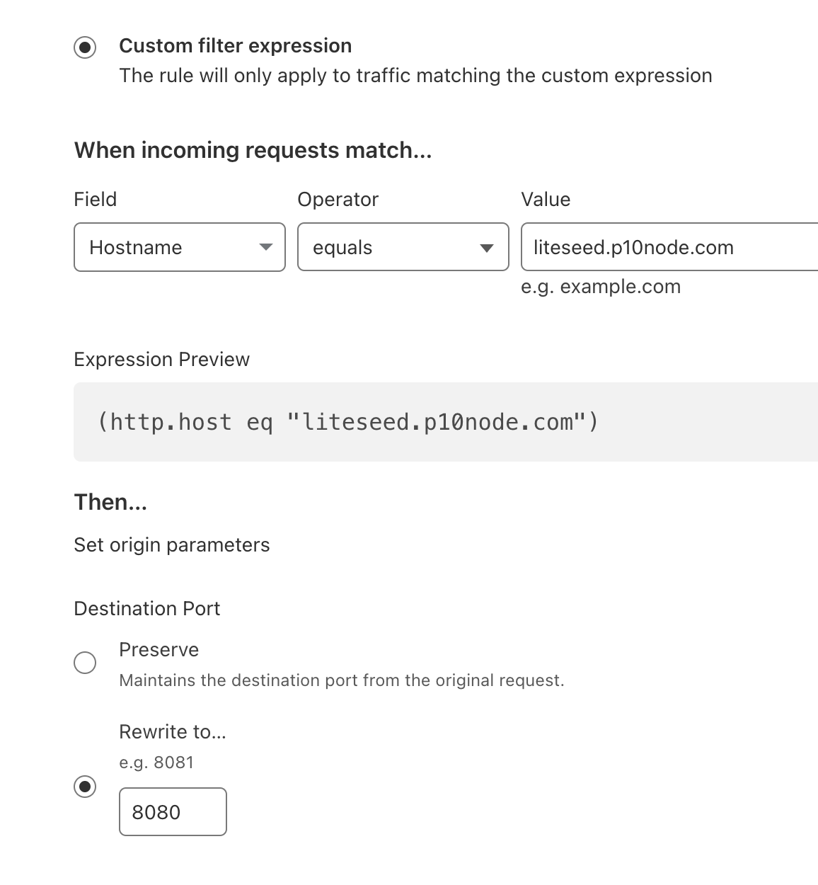

# Liteseed

## Origin document

- https://github.com/liteseed/edge
- https://docs.liteseed.xyz/operators/running-a-node

## System Requirements

- CPU - 1GHz
- Memory - 1GiB
- Storage - 8GiB
- OS - Linux

## Steps

### 0. Prepare

Docker

```bash
curl -fsSL https://get.docker.com -o get-docker.sh
sudo sh get-docker.sh
rm -rf get-docker.sh

# Check docker version

sudo docker --version
```

### 1. Clone the repository

```bash
mkdir ~/liteseed
git clone https://github.com/liteseed/edge ~/liteseed/edge
```

### 2. Build Docker image

```bash
cd ~/liteseed/edge
sudo docker build -t edge .
```

### 3. Create Docker volume

```bash
sudo docker volume create liteseed
```

### 4. Create wallet

```bash
sudo docker run -v liteseed:/data edge generate
```

Backup your wallet

```bash
sudo cat /var/lib/docker/volumes/liteseed/_data/signer.json
```

Save the information that appears

> [!CAUTION]
> Please store it carefully. Do not share with anyone, and don't lose it.

Get your address and faucet to it

```bash
sudo docker run -v liteseed:/data edge balance
```

### 5. Create database

```bash
sudo docker run -v liteseed:/data edge migrate
```

### 6. Run your edge

```bash
export EXTERNAL_PORT=8080 # change it if you want
sudo docker run -p $EXTERNAL_PORT:8080 -v liteseed:/data edge start
```

You can use `tmux`, `screen` or just add param `-d` for running in background.

```bash
export EXTERNAL_PORT=8080 # change it if you want
sudo docker run -d -p $EXTERNAL_PORT:8080 -v liteseed:/data edge start
```

### 7. Domain record

There're 2 options you can follow to map your domain with the edge service. Only choose 1.

- [7.1 Nginx](#71-nginx)
- [7.2 Cloudflare forward](#72-cloudflare-forward)

#### 7.1 Nginx

Go to your DNS service, add A record your domain to IP **WITHOUT proxy** (DNS only).



##### Install certbot

```bash
sudo apt update
sudo apt install -y certbot nginx
```

##### Config

```bash
sudo certbot certonly --manual --preferred-challenges dns \
--email <your-email-address> \
-d <your-domain.abc>
```

`sudo nano /etc/nginx/sites-available/default`

```conf
# Force redirects from HTTP to HTTPS
server {
    listen 80;
    listen [::]:80;
    server_name <your-domain.abc>;

    location / {
        return 301 https://$host$request_uri;
    }
}

# Forward traffic to your node and provide SSL certificates
server {
    listen 443 ssl;
    listen [::]:443 ssl;
    server_name <your-domain.abc>;

    ssl_certificate /etc/letsencrypt/live/<your-domain.abc>/fullchain.pem;
    ssl_certificate_key /etc/letsencrypt/live/<your-domain.abc>/privkey.pem;

    location / {
        proxy_pass http://localhost:8080; # or your port you changed at 6.
        proxy_set_header Host $host;
        proxy_set_header X-Real-IP $remote_addr;
        proxy_set_header X-Forwarded-For $proxy_add_x_forwarded_for;
        proxy_http_version 1.1;
    }
}
```

Save and exit nano.

Test the config

```bash
sudo nginx -t
```

And restart nginx

```bash
sudo service nginx restart
```


#### 7.2 Cloudflare forward

Go to your Cloudflare DNS service, add A record your domain to IP **WITH proxy**.



Go to **Rules** > **Origin Rules**

Click on `+ Create rule`, set your `Rule name (required)` and config field `Hostname` equals to your domain has setup above.

And `Rewrite to...` your port. (8080)




Then click `deploy`.


### 8. Stake to your edge

Check if your domain return data like that:

```json
{
  "Address": "<address>",
  "Gateway": {
    "URL": "https://arweave.net"
  },
  "Name": "Edge",
  "Version": "0.0.4"
}
```

Then you good to stake

```bash
export URL="<your-url>" # example: https://liteseed.p10node.com/
sudo docker run -v liteseed:/data edge stake -u "$URL"
```

> [!WARNING]  
> You need to have balance before stake, please check your balance with `sudo docker run -v liteseed:/data edge balance` and faucet if needed.


## Community

https://t.me/p10node

## Tags

`ar`, `liteseed`, `docker`, `go`, `domain`
